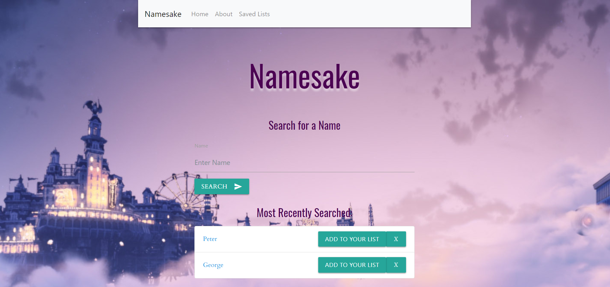
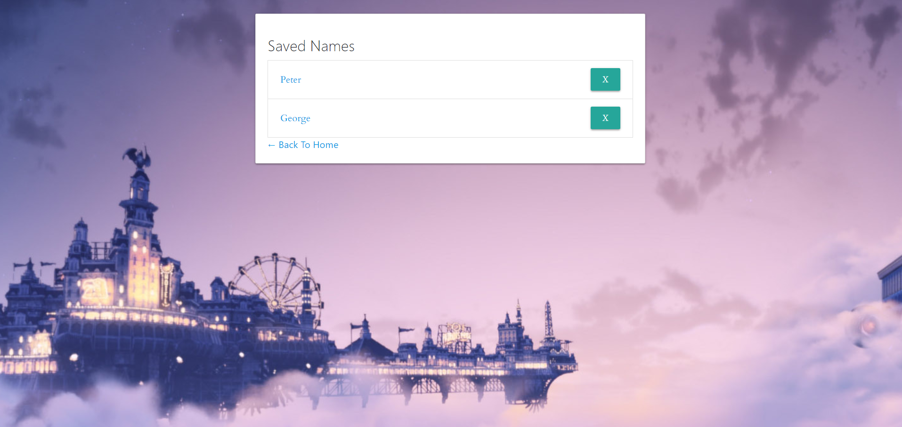

# Namesake
Namesake provides users the ability to research names to discover their orgins and uses for further research, whether that be to save potential baby names or character names for a novels.


## Technologies Used
* Javascript
* node.JS
* mySQL
* mySQL Workbench
* Sequelize
* Materialize
* mySQL (NPM install)
* Axios (NPM install)
* Request (NPM install)
* Express (NPM install)
* Handlebars (NPM install)


## APIs Used
* Behind the Name

## Prerequisites
* NPM install (See Tech Used section above)
* SQL database

## What does it do?



User can type in names, delete the names that appear by clicking the 'x', and then add them to a list.


The list page shows the user all the names they saved.

## How did we set it up?
The initial step in creating the app was establishing the MVC (Model-View-Controller) setup. The MVC in layman's terms is an organizational, architectural pattern used to allow for cleaner code that is easier to analyze and easier for a team of developers to work simultaneously. For Namesake, instead of controller, we used routes. Within the routes folder, we started the code to connect to the api as well as the code to connect the html pages. 

### Connecting to the API
``` 
module.exports = function (app) {
  // Get all examples
  app.get("/api/behindnames/:name", function (req, res) {
    //this search is off of query parameters on URL path, using the name input box & search value
    var search = req.params.name;
    //APIKey is your actual key, hidden in the .env
    var APIKey = keys.KEY;
    axios.get(`https://www.behindthename.com/api/lookup.json?name=${search}&key=${APIKey}`).then(
      function (response) {
        res.json(response.data)
      }
    );
  });

```

Within the Models folder, we also placed the code necessary to login into the database and utilize sequelize language.


### Logging into the database utilizing Sequelize
```
"use strict";

var fs = require("fs");
var path = require("path");
var Sequelize = require("sequelize");
var basename = path.basename(module.filename);
var env = process.env.NODE_ENV || "development";
var config = require(__dirname + "/../config/config.json")[env];
var db = {};

if (config.use_env_variable) {
  var sequelize = new Sequelize(process.env[config.use_env_variable]);
} else {
  var sequelize = new Sequelize(
    config.database,
    config.username,
    config.password,
    config
  );
}

fs.readdirSync(__dirname)
  .filter(function(file) {
    return (
      file.indexOf(".") !== 0 && file !== basename && file.slice(-3) === ".js"
    );
  })
  .forEach(function(file) {
    var model = sequelize.import(path.join(__dirname, file));
    db[model.name] = model;
  });

Object.keys(db).forEach(function(modelName) {
  if (db[modelName].associate) {
    db[modelName].associate(db);
  }
});

db.sequelize = sequelize;
db.Sequelize = Sequelize;

module.exports = db;

```

 The server.js was then created to connect the routes, set up handlebars, and establish the middleware--code which acts as a bridge between the client and server sides of the application.
 
```
require("dotenv").config();
var express = require("express");
var exphbs = require("express-handlebars");
var db = require("./models");
var app = express();
var PORT = process.env.PORT || 3000;

// Middleware allows the client data to be translated into json, storing result of the translation in req.body
app.use(express.urlencoded({ extended: true }));
app.use(express.json());

//this public makes the public folder the root level of your URL path
//this is important for handlebars to access any of the other files in that level
//this is not file structure but URL path
app.use(express.static("public"));

// Handlebars
app.engine(
  "handlebars",
  exphbs({
    defaultLayout: "main"
  })
);
app.set("view engine", "handlebars");

// Routes
require("./routes/apiRoutes")(app);
require("./routes/htmlRoutes")(app);

var syncOptions = { force: false };

// If running a test, set syncOptions.force to true
// clearing the `testdb`
if (process.env.NODE_ENV === "test") {
  syncOptions.force = true;
}

```

Also within the server.js file, we created the code necessary to listen to the port. 

```
// Starting the server, syncing our models ------------------------------------/
db.sequelize.sync(syncOptions).then(function() {
  app.listen(PORT, function() {
    console.log(
      "==> 🌎  Listening on port %s. Visit http://localhost:%s/ in your browser.",
      PORT,
      PORT
    );
  });
});

module.exports = app;

```

Once the MVC and the server are created, we utilized sequelize to generate two seperate tables for the names and the origins.

The list field is used to help users save names to a list. The default value is set to false.

### Names table
```
module.exports = function(sequelize, DataTypes) {
  var Names = sequelize.define("Names", {
    name: DataTypes.STRING,
    gender: DataTypes.TEXT,
    list: {
      type: DataTypes.BOOLEAN,
      defaultValue: false
    }
  });

  Names.associate = function(models) {
    Names.hasMany(models.Origins, {
      onDelete: "cascade"
    });
  };

  return Names;
};

```


The origin's foreign key refers to the primary key of the name tables due to the one to many relationship between a name and its possible mulitible origins. 

```
module.exports = function(sequelize, DataTypes) {
  var Origins = sequelize.define("Origins", {
    origin: DataTypes.STRING,
    origingender: DataTypes.STRING
  });

  Origins.associate = function(models) {
    Origins.belongsTo(models.Names, {
      foreignKey: {
        allowNull: false
      }
    });
  };
  return Origins;
};
```

The next step was to utilize the connection to the Behind the Name API via axios in the apiroutes file. On the client side, we created methods inside of an API object that worked with the returned data to save the name, the name's origins, to display the names on the webpage, delete the names, and update the name record--a function that is necessary for us to later save it into a list. 

```
var API = {
  saveName: function(example) {
    return $.ajax({
      headers: {
        "Content-Type": "application/json"
      },
      type: "POST",
      url: "api/names",
      data: JSON.stringify(example)
    });
  },
  //Example is the object created in the saveOrigin function, containing the name ID from the table and the information from the external API request
  saveOrigin: function(example) {
    return $.ajax({
      headers: {
        "Content-Type": "application/json"
      },
      type: "POST",
      url: "/api/origins",
      data: JSON.stringify(example)
    });
  },
  getNames: function() {
    return $.ajax({
      url: "api/names",
      type: "GET"
    });
  },
  deleteName: function(id) {
    return $.ajax({
      url: "api/names/" + id,
      type: "DELETE"
    });
  },

  updateName: function(id) {
    return $.ajax({
      url: "api/list/" + id,
      type: "PUT"
    });
  }
};

```

We then created functions that would pull user input and clicks to then call on these methods. Among these were the submit button, that takes the information written in the search box, the delete button, and the add to list button. 

### Code for the delete button

```
var handleDeleteBtnClick = function() {
  var idToDelete = $(this)
    .parent()
    .attr("data-id");

  API.deleteName(idToDelete).then(function() {
    refreshNames();
  });
};

$nameList.on("click", ".delete", handleDeleteBtnClick);

```

Within the getName method, we added another ajax call that pulls the unique orgins and saves them into an object which will then be saved into the origin table on the server side.

```
  API.saveName(name).then(function(response) {
        //response is the data returned
        refreshNames();
        console.log("nameid:" + response.id);
        //response.id is the ID from the name table, taken from save name
        //data is the external API result
        var origin = {
          usages: data,
          nameid: response.id
        };

        console.log(origin.usages[0].usages[0].usage_full);
        console.log(origin.usages[0].usages[0].usage_gender);
        API.saveOrigin(origin).then(function(response) {});
      });

```

The server side and the client side are connected via the url and each action must be reciprocated. On the client side, we mirrored each of the methods. 

To create the list, we give each record within the names table a default boolean value of false. After a user clicks th "Add to List" button, the value is then changed to true. 

```
app.put("/api/list/:id", function (req, res) {
  db.Names.update({
    list: 1
  }, {
    where: {
      id: req.params.id 
    }
  }).then(function(dbTodo) {
    res.json(dbTodo);
  });
});

```

The list page only shows those records with a true value. This functionality can only work temporarily and it is not a long term solution. Future development will improve upon this by creating unique tables for each user. 


## Challenges and Future Improvements
This project was very difficult since it was one of the first times where we had to utilize an MVC, sequelize, and an external API. Understanding how all those things linked between files was challenging especially since the syntax can be very sensitive.

There are many future impovements, among them is creating a proper way of saving names to lists for each user. We would also like to add to the functionality and perhaps utilize a better API that provides more detail. 

## Acknowlegments 
Many people helped us along the way, Alyssa Graham and Phil Loy especially. 